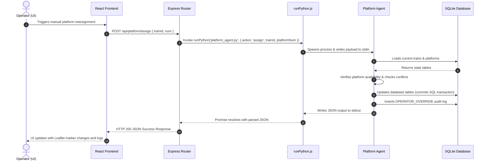
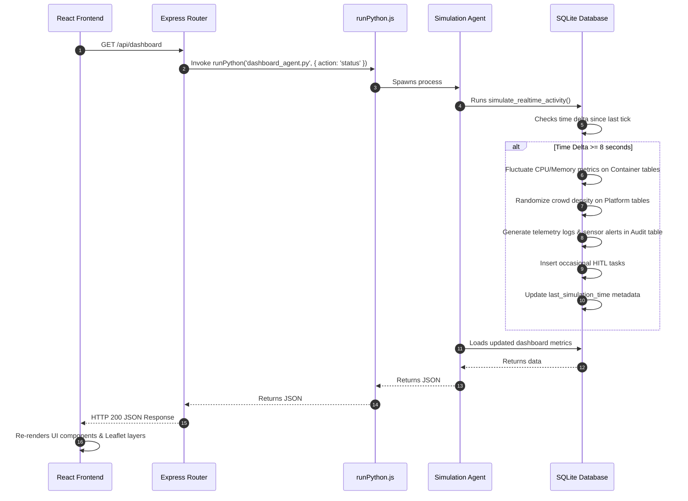

# RailSync AI - Railway Operations Control Center

## Project Overview

RailSync AI is an intelligent, multi-agent railway operations control center designed to automate scheduling, monitor station infrastructure, analyze track telemetry, dispatch multilingual announcements, and simulate active disruptions. 

Built using a hybrid framework of React on the frontend and Node.js with Python AI agents on the backend, RailSync AI integrates SQLite storage, process spawning pipelines, dynamic mapping controls, and real-time state synchronization to deliver a robust traffic management interface.

---

## Core System Architecture

The project is structured into four main operational layers:

1. **Client Interface**: React SPA compiled with Vite. It features a responsive dashboard with a custom theme-aware CSS system. Leaflet JS is used to render spatial railway networks, train markers, pulsing alerts, and detours.
2. **Express API Gateway**: A Node.js backend acting as the API Gateway. It defines REST endpoints, proxies client requests, and communicates with the Python agent framework by executing scripts as child processes.
3. **Multi-Agent Python Core**: A collection of isolated, script-based Python agents that handle analytical operations, schedule optimizations, simulated train runs, and natural language communication. Agents use a shared data layer and connect to Groq client interfaces for generative model execution.
4. **Data Persistence**: A SQLite database (`railsync.db`) containing state tables for train schedules, platforms, system container telemetry, pending decision queues, and audit trails. It runs a dynamic telemetry simulator that updates background logs and device stats in real-time.

```mermaid
graph TD
    subgraph Client [Client - Web Browser]
        ReactSPA["React SPA (Vite)<br/>Pages & Components<br/>Leaflet Map Control"]
    end

    subgraph Backend [Express API Gateway (Port 3001)]
        ExpressServer["Express.js Server<br/>server.js"]
        RouterLayer["Express Router Layer<br/>(routes/dashboard.js, platform.js, etc.)"]
        runPythonHelper["runPython.js<br/>Spawns child processes<br/>via stdin/stdout JSON"]
    end

    subgraph MultiAgentSystem [Multi-Agent System (Python)]
        DashboardAgent["dashboard_agent.py"]
        SchedulerAgent["scheduler_agent.py"]
        PlatformAgent["platform_agent.py"]
        DisruptionAgent["disruption_agent.py"]
        PassengerAgent["passenger_agent.py"]
        SimulationAgent["simulation_agent.py"]
        MonitoringAgent["monitoring_agent.py"]
        HITLAgent["hitl_agent.py"]
        AuditAgent["audit_agent.py"]
        
        sharedDataStore["shared/data_store.py<br/>Loads state, seeding, telemetry updates"]
        groqClient["shared/groq_client.py<br/>Interfaces with Groq LLM API"]
    end

    subgraph DataPersistence [Persistence Layer]
        SQLiteDB["SQLite Database<br/>(railsync.db)"]
    end

    %% Flow connections
    ReactSPA <-->|HTTP REST / JSON / Proxy| RouterLayer
    RouterLayer --> runPythonHelper
    runPythonHelper <-->|Spawn Stdin/Stdout JSON| MultiAgentSystem
    MultiAgentSystem <-->|SQL Queries / Read & Write| SQLiteDB
    MultiAgentSystem -.->|GenAI LLM Calls| groqClient
```

---

## Technical Flow Diagrams

### 1. Operator Actions & State Persistence Flow

This diagram demonstrates how operator overrides (such as assigning a train to a different platform) are received by Express, executed by a spawned Python agent, stored in SQLite, and rendered back on the client map.



### 2. Dynamic Telemetry & Background Simulation Flow

Every 8+ seconds, client queries to the dashboard trigger a telemetry tick. This updates container performance statistics and logs active sensor triggers inside the SQLite persistent tables.



---

## Core System Modules

### Train Scheduling
Manages timetable coordinates and delay cascade monitoring. The Scheduler Agent parses delay Cascade logs, uses MILP metrics to flag scheduling conflicts (delayed status and at-risk statuses), and suggests optimization guidelines to reduce global arrival latencies.

### Platform Assignment
Handles track assignments at major hub stations like New Delhi (NDLS). Tracks platform states (occupied, free, reserved), cleaning intervals, and passenger crowd levels. Operators can execute reassignments which update SQLite persistent tables in real-time.

### Disruption Recovery
Monitors major network anomalies such as train breakdowns, track blockages, weather delays, and signal failures. Panning algorithms in Leaflet center on the coordinates of the disruption. Bypass trajectories are mapped as dashed lines, highlighting blocked and rerouted pathways.

### Passenger Communication
Handles traveler announcements. Generates announcement translations in regional Indian languages (Hindi, Tamil, Kannada, Marathi) based on delay templates. Allows operators to broadcast simulated text-to-speech cues to station speakers and terminal monitors.

### Simulation Lab
Provides what-if testing parameters. Operators can simulate delays at key stations (New Delhi, Agra Cantt, Mathura Jn) and watch train markers animate along coordinate paths. Upon completion, a red highlight circle is drawn around the target hub.

### System Monitoring
Tracks CPU usage, RAM levels, uptime metrics, and container health for core background services (such as Kafka brokers, data ingestion pipelines, model inferences, and databases).

---

## Database Schema Design

The persistence engine relies on a local SQLite database (`railsync.db`). The database schema is defined as follows:

### 1. `trains`
Stores schedule data for trains running in the network.
* `id` (TEXT, Primary Key): Unique train code (e.g. "12002").
* `name` (TEXT): Train name (e.g. "Bhopal Shatabdi").
* `from_station` (TEXT): Origin station abbreviation (e.g. "NDLS").
* `to_station` (TEXT): Target station abbreviation (e.g. "RKMP").
* `time_val` (TEXT): Scheduled arrival/departure time.
* `status` (TEXT): Current operational status ("on-time", "delayed", "risk").
* `delay` (INTEGER): Delayed duration in minutes.
* `platform` (TEXT): Assigned platform number.

### 2. `platforms`
Tracks platform availability and crowd load.
* `num` (TEXT, Primary Key): Platform ID (e.g. "01").
* `status` (TEXT): Platform occupancy state ("occupied", "free", "reserved").
* `train` (TEXT): Occupying train details (if occupied).
* `arrival` (TEXT): Current train arrival timestamp.
* `departure` (TEXT): Current train departure timestamp.
* `eta` (TEXT): Train ETA (if reserved).
* `nextExp` (TEXT): Scheduled arrival time for next train (if free).
* `note` (TEXT): Station note (e.g. "CLEANING").
* `crowd` (INTEGER): Current crowd level as a percentage.

### 3. `audit_logs`
An immutable log repository tracking system state shifts and operator overrides.
* `id` (TEXT, Primary Key): Event index code (e.g. "EVT-4821").
* `ts` (TEXT): Time code of the logged event.
* `type` (TEXT): Event categorization ("AI_DECISION", "OPERATOR_OVERRIDE", "ALERT", "SYSTEM").
* `module` (TEXT): Target operational subsystem.
* `source` (TEXT): Event source ("AI", "Operator", "Sensor", "System").
* `action` (TEXT): Description of the logged action.
* `status` (TEXT): Status of the action ("Applied", "Logged", "Active", "Broadcast", "Resolved").
* `hash` (TEXT): Hash check code computed via SHA-256 for integrity auditing.

### 4. `hitl_pending`
Holds pending optimization recommendations that require human oversight.
* `id` (TEXT, Primary Key): Recommendation identifier (e.g. "HIL-0431").
* `type` (TEXT): Operational task type ("REROUTE", "SCHEDULE", "PLATFORM", "SPEED", "COMMS").
* `priority` (TEXT): Operational urgency ("LOW", "MEDIUM", "HIGH", "CRITICAL").
* `train` (TEXT): Focus train identifier.
* `action` (TEXT): Recommended action to perform.
* `confidence` (INTEGER): Confidence score computed by model validations.
* `passengers` (INTEGER): Affected passenger volume.
* `delay` (TEXT): Latency reduction target (e.g. "-22 min").

### 5. `containers`
Maintains container metrics for microservice components.
* `name` (TEXT, Primary Key): Subsystem container name (e.g. "platform-optimizer").
* `status` (TEXT): Health label ("healthy", "warning", "error").
* `cpu` (INTEGER): CPU utilization percentage.
* `mem` (INTEGER): RAM utilization percentage.
* `uptime` (TEXT): Container uptime duration.
* `restarts` (INTEGER): Failover restart counts.

---

## File Structure

```
Railway_Automations/
├── frontend/
│   ├── src/
│   │   ├── components/       # Reusable layout interfaces (Sidebar, Header, etc.)
│   │   ├── pages/            # View pages (Dashboard, Disruption, Simulation, etc.)
│   │   ├── App.jsx           # Application routing, views & state management
│   │   ├── main.jsx          # UI entry point
│   │   ├── index.css         # Design system & global styles
│   │   └── layout-fixes.css  # Spacing adjustments for page cards
│   ├── package.json          # Node scripts for client interface
│   └── vite.config.js        # Vite config & API proxy routing rules
├── python/
│   ├── shared/
│   │   ├── data_store.py     # SQLite persistence connection & simulation tick
│   │   └── groq_client.py    # LLM inference API client
│   ├── scheduler_agent.py    # AI scheduling conflict resolution
│   ├── platform_agent.py     # Platform track assignment supervisor
│   ├── disruption_agent.py   # Reroute calculation & bypass geometry mapping
│   ├── simulation_agent.py   # What-if animation run calculator
│   └── ...                   # Other agents (Audit, Passenger, HITL, Dashboard)
├── server/
│   ├── routes/               # API endpoints matching agent outputs
│   ├── runPython.js          # Process spawning wrapper for backend
│   └── server.js             # Express application configuration
├── package.json              # Main concurrent control script
└── README.md                 # Project documentation
```

---

## Getting Started

### Prerequisites
* **Node.js** (v20.19+ or v22.12+)
* **Python 3** (Assumed to be in system PATH as `python`)

### Installation & Run

1. Clone or extract the project files to your directory.
2. Navigate to the root directory and install dependencies across the client, API gateway, and root:
   ```bash
   npm run install:all
   ```
3. Initialize and run the system:
   ```bash
   npm start
   ```
   This concurrent script launches:
   * Express API gateway on `http://localhost:3001`
   * Vite client interface on `http://localhost:5173`

4. Open `http://localhost:5173` in a web browser.
5. In the login page, use one of the **Quick Official Login** profiles (Admin, Traffic Controller, or Station Master) to log in instantly.
